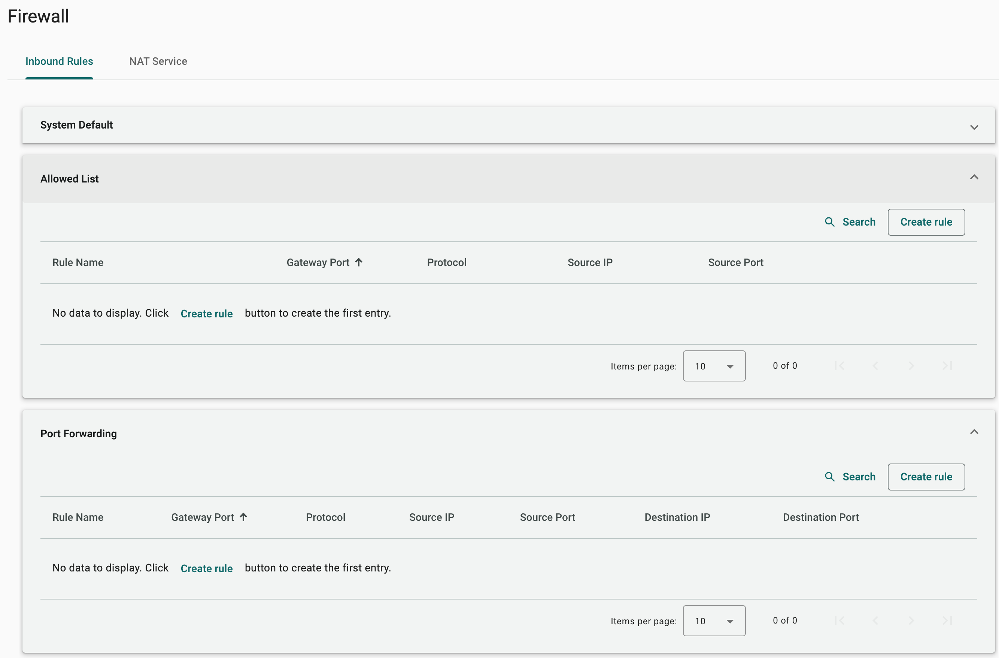
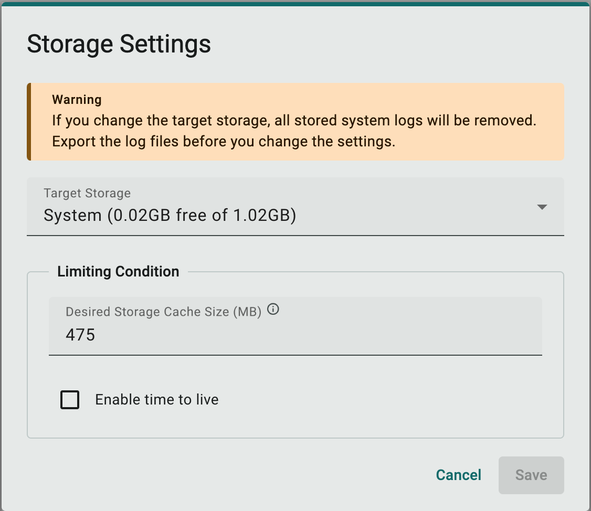
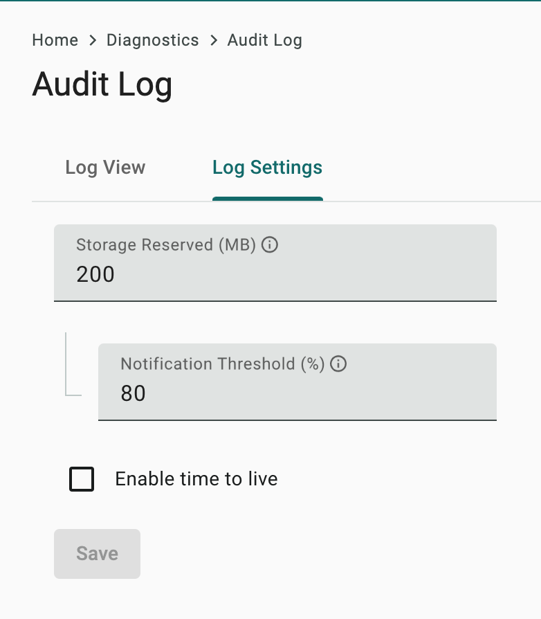

# Enforce Secured Setting on AIG

Document Version: V1.1

### Change Log

| Version | Date       | Content           |
| ------- | ---------- | ----------------- |
| 1.0     | 2025-01-20 | document created. |

### Purpose

This document lists out the recommended actions to be taken in AIG before deployments, to secure IIoT gateways in the field.

---

### 1. Refer the Security Hardening Guide

 - [The Security Hardening Guide for the AIG-302 Series](https://cdn-cms-frontdoor-dfc8ebanh6bkb3hs.a02.azurefd.net/getmedia/0ac90db0-a685-4ad1-b02d-cae8b33f5bde/moxa-the-security-hardening-guide-for-the-aig-302-series-tech-note-v1.0.pdf)

### 2. Disable Unused Interfaces

The user should disable unused interfaces to prevent unexpected access to the gateway.

> Note: The user must realize that although the gateway has become more secured by disabling unused interfaces, the tradeoff is it's resilience because the backup options to access the gateway have been disabled.

#### 2.1 Network

Validate the network interface settings and disable the unused ones.

- Cellular
- DHCP Server
- LAN
- Wi-Fi

### 3. Configure the System

The user should have the security related settings properly setup to enhance gateway security.

#### 3.1 Time - Timezone and Date Time

System time is widely used in security related actions, such as certificate validation. The user should configure system time zone and time properly and enable auto sync if possible.

#### 3.2 Firewall - Review the inbound rules

- Review the firewall inbound rules and ensure that only the necessary/recognized service/ports are listed in the inbound allowed list and port forwarding.

  

#### 3.3 Firewall - Review NAT Service

AIG allow south-bound device connect to Internet directly via enable NAT Service. The user should disable it if no such requirement.

#### 3.4 HTTPS - Replace by your own X.509 certificate

If, for some reason, the user decides to leave https service enabled in the field, it's recommended to import your own certificate and private key for the HTTPS service, so user's working laptop can successfully validate the identity of the gateway.

The HTTPS service on AIG comes with a set of self-signed certificate and private key by default. If the user is not able to replace the default with your own certificate and private key, we recommend the user to export the default root certificate from AIG and add it to the trusted root certificate authority list on your working laptop.

#### 3.5 System Log - Storage Settings

The default storage size for keeping system logs is 100 Mb. The user should adjust the setting based on the application's need.

  

#### 3.6 Audit Log - Storage Settings

The default storage size for keeping system logs is 100 Mb. The user should adjust the setting based on the application's need.

  

### 4. X.509 Certificate based Mutual Authentication

All the cloud applications in ThingsPro Edge supports X.509 certificate based authentication, including:

- Azure IoT Edge
- Azure IoT Device
- MQTT Client

Please always consider using X.509 certificate based authentication in production.
